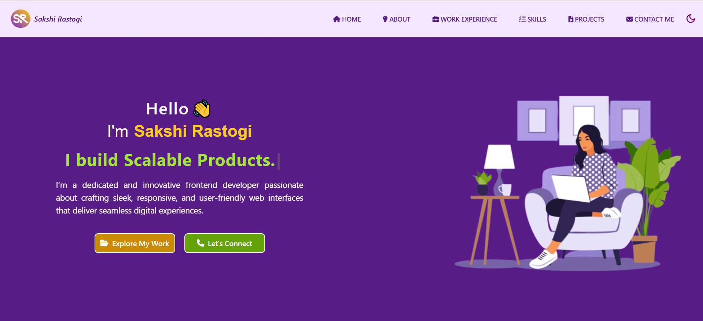
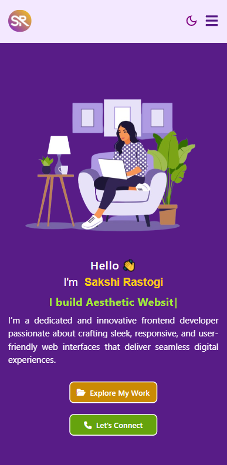
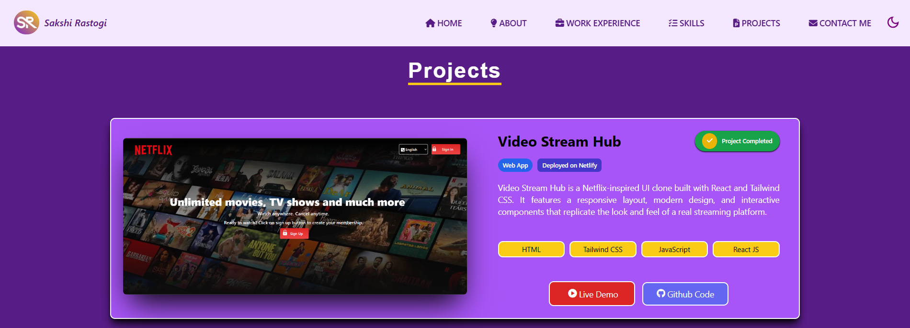
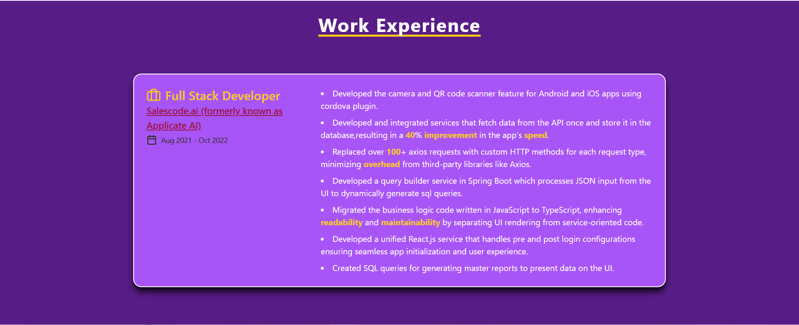
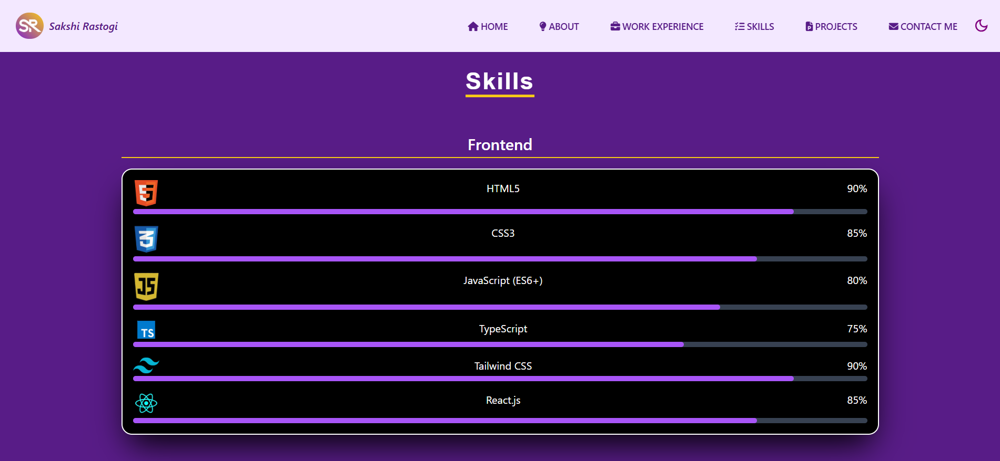
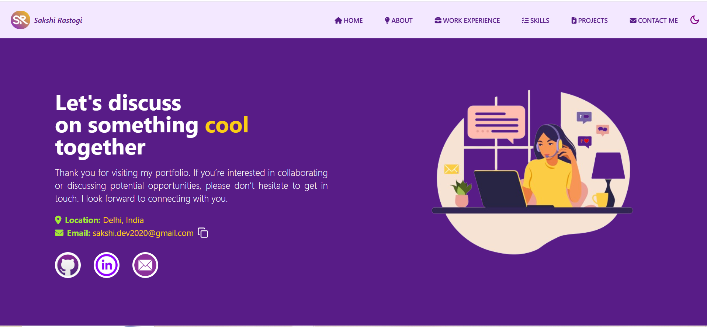

# 🌟 Portfolio Website

  

  
 

A **personal portfolio website** built using **React.js, Tailwind CSS, and Vite** to showcase my projects, skills, and work experience. The site is fully responsive, lightweight, and optimized for performance. 

## 🔗 Live Demo  
[](https://sakshi-rastogi-portfolio.netlify.app/)

---

## 📖 Table of Contents
- [Features](#-features)  
- [Tech Stack](#-tech-stack)  
- [Folder Structure](#-folder-structure)  
- [Installation & Setup](#-installation--setup)  
- [Available Scripts](#-available-scripts)  
- [Deployment](#-deployment)  
- [Contributing](#-contributing)  
- [Performance](#-performance)  
- [Future Improvements](#-future-improvements)  
- [Screenshots](#-screenshots)  
- [Author](#-author)  

---

## 🚀 Features
- 🌙 **Dark/Light mode** support with persistent theme storage  
- 📱 **Fully responsive design** across mobile, tablet, and desktop  
- 🖼️ **Projects showcase** with images, descriptions, and live/demo links  
- 💼 **Work experience section** with role, company, and timeline  
- 🧑‍💻 **Skills section** with categorized technologies  
- ⚡ **Optimized build** for fast load time  

---

## 🛠️ Tech Stack
- **Frontend:** React.js, Tailwind CSS
- **Build Tool:** Vite 
- **Routing:** React Router  
- **Icons:** Lucide React
- **Deployment:** Netlify  
- **Package Manager:** npm 

---

```
portfolio/
├── public/               # Static files
│   ├── favicon.png
├── src/
│   ├── assets/           # Images
│   ├── components/       # Reusable UI components
│   │   ├── HeaderComponent.jsx
│   ├── pages/            # Main pages
│   │   ├── HomePageComponent.jsx
│   │   ├── AboutComponent.jsx
│   │   ├── WorkExperienceComponent.jsx
│   │   ├── SkillsComponent.jsx
|   |   ├── ProjectListComponent.jsx
|   |   └── ContactComponent.jsx
│   ├── utils/            # Helper functions (theme, API calls, constant data etc.)
│   ├── App.jsx           # Root component
│   └── main.jsx          # Entry point
├── .gitignore
├── index.html            # Entry file of website
├── package.json
├── tailwind.config.js
├── postcss.config.js
├── vite.config.js
└── README.md
```

---

## ⚙️ Installation & Setup

Clone the repository and install dependencies:  

```bash
# Clone repo
git clone https://github.com/your-username/portfolio.git

# Navigate to project folder
cd portfolio

# Install dependencies
npm install
```

Run the development server:  
```bash
npm run dev
```

Build for production:  
```bash
npm run build
```

Preview production build locally:  
```bash
npm run preview
```

---

## 📜 Available Scripts

- `npm run dev` → Runs the app in development mode.  
- `npm run build` → Builds the app for production.  
- `npm run preview` → Previews production build locally.  

---

## 🌍 Deployment

- **Netlify:**  
  Drag & drop the `dist` (or `build`) folder into Netlify dashboard.  

---

## 🤝 Contributing

1. Fork the repo  
2. Create a new branch (`git checkout -b feature/your-feature-name`)  
3. Make your changes  
4. Commit (`git commit -m "Added new feature"`)  
5. Push (`git push origin feature/your-feature-name`)  
6. Open a Pull Request  

---

## ⚡ Performance

- ⚙️ Built with **React + Vite** for fast bundling and HMR.  
- ⚡ Lazy loading for images and components.  
- 🎨 Optimized Tailwind classes for minimal CSS footprint.  
- 📦 Bundle size minimized using tree-shaking.  

---

## 🔮 Future Improvements

- 🛠️ Integrate a **CMS (Sanity/Contentful/Strapi)** for easy content updates.   
- 📩 Enhance **contact form** with backend email service (Node.js/Express).  

---

## 📸 Screenshots

### 🏠 Homepage (Desktop & Mobile)  

#### Desktop View
  

#### Mobile View


### 📂 Projects Section  


### 💼 Work Experience 


### 🛠️ Skills  


### 📬 Contact Section  

---

## 👤 Author

**Sakshi Rastogi**  
- 🌐 Portfolio: [my-portfolio-link](https://sakshi-rastogi-portfolio.netlify.app/)  
- 💼 LinkedIn: [linkedin.com/in/sakshi-rastogi-461813173/](https://www.linkedin.com/in/sakshi-rastogi-461813173/)  
- 🐙 GitHub: [github.com/SakshiRastogi1302](https://github.com/SakshiRastogi1302)  

---

✨ Feel free to fork this repo and customize it for your own portfolio!  
